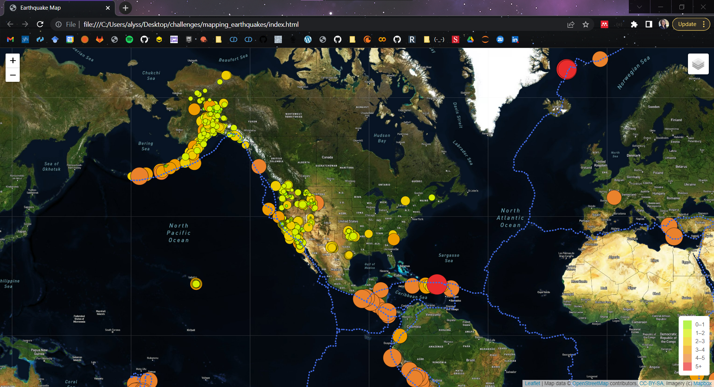
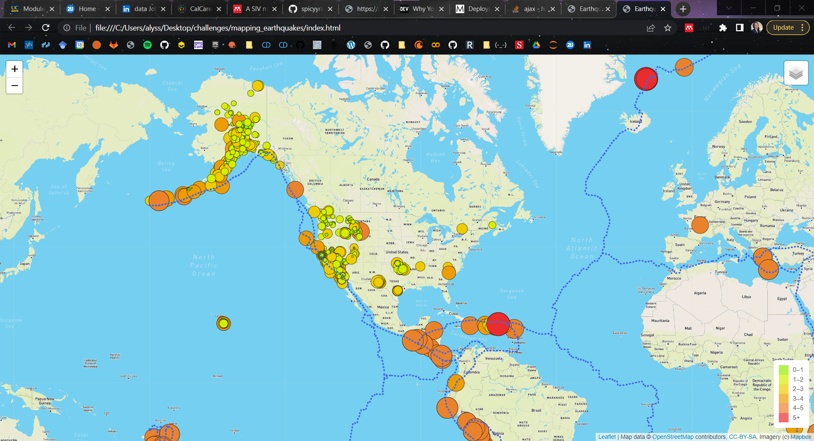
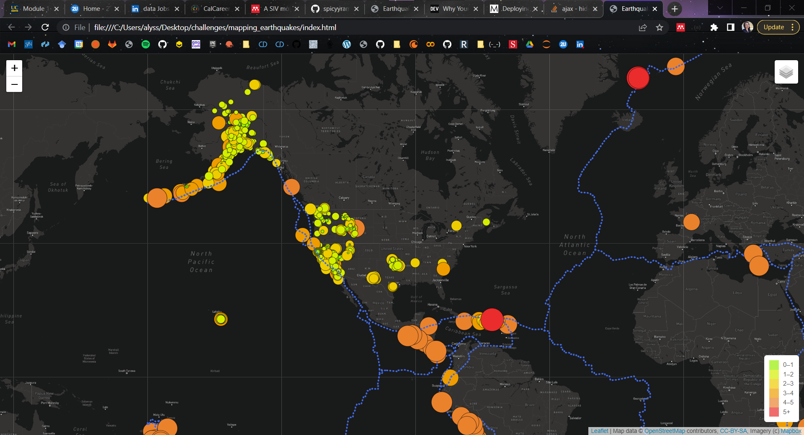
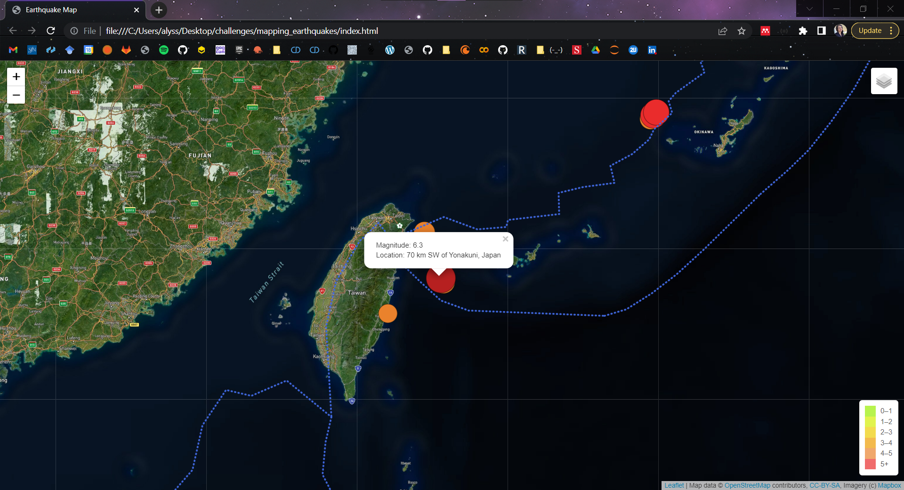
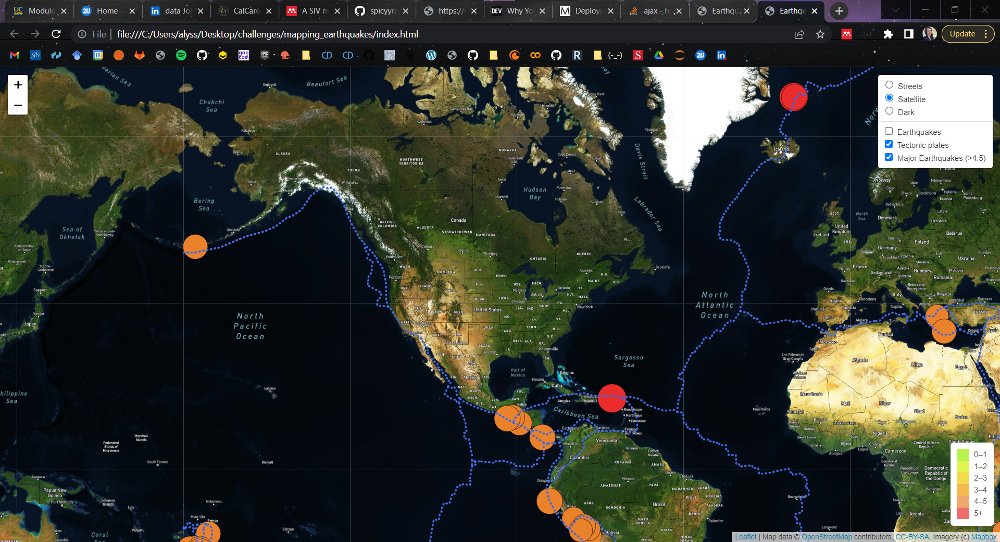

# Mapping Earthquakes
Creating map using Leaflet to display earthquake & tectonic plate data.

## Satellite Mode

 
 

## Streets Mode

 
 

## Dark Mode

 
 

## Pop-up w/description
Clicking on any earthquake marker will display a text box with the **magnitude** and **location** of the earthquake. 

 
 

## Filters
The map can be filtered to display all earthquakes, earthquakes over 4.5 magnitude, and the borders of tectonic plates.  

